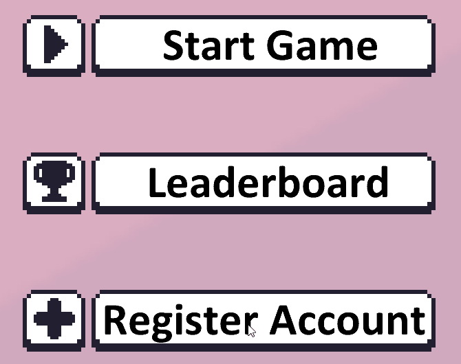

 

  <h3>A Proof of Concept Platformer built from the ground up!</h3>

<!-- TABLE OF CONTENTS -->

  
Table of Contents

  <ol>
    <li>
      <a href="#about-the-project">About The Project</a>
      <ul>
        <li><a href="#mechanics">Mechanics</a></li>
        <li><a href="#built-with">Built With</a></li>
      </ul>
    </li>
    <li>
      <a href="#showcase">Showcase</a>
    </li>
    <li>
        <a href="#credit">Credit</a>
    </li>
  </ol>

<!-- ABOUT THE PROJECT -->
## About The Project

 
 
Have you ever wanted to make your own 2D game?
 
Well I have and my trials and many errors can be seen here in my POC SugaryEngine.
 
 
This project contains a 2D speedrun platformer built using the monogame framework.

 

### Mechanics
This game is all about speed and applying fun mechanics, this 2D platformer for example has no jump button!
 
Instead you can use the mouse to charge up a jump! use this to gain massive speed, or jump extremely high after some charging.

### Built With

* [.NET](https://dotnet.microsoft.com/en-us/apps/games)
* [MonoGame](https://www.monogame.net/)
* [MSTest](https://docs.microsoft.com/en-us/dotnet/core/testing/unit-testing-with-mstest)
* [Laravel](https://laravel.com/)
* [Boostrap](https://getbootstrap.com/)
* [MySQL](https://www.mysql.com/)

(<a href="#top">back to top</a>)

<!-- Showcase -->
## Showcase
 
<h3>Main Menu</h3>

A clean main menu giving you direct access to anything you might want to do.

  
 

<h3>Charge your jump!</h3>

Keep track of your charge bar to make large jumps or keep it short and fast.

  
 

<h3>Movement</h3>

Master the mobility and do cool manouvers to make your way through the level.

  
 

<h3>Checkpoints</h3>

Acquire checkpoints spread out through the level to make your life a bit easier.

  
 

<h3>Register</h3>

When you first launch the game you will be granted a special game key, this game key is automatically connected to the runs you finish and can be used to register an account on the leaderboards!

  
 

<h3>Leaderboards</h3>

View the ever expanding leaderboards to see how fast you are.

  
 

<h3>Runs</h3>

View or comment on anyones run, or update your runs with useful information (or to plug your twitch)

  
 

<h3>Moderation</h3>

Use the management tools as an admin to moderate any chats or quickly help out any people having problems.

  
 

<!-- ROADMAP -->
## Credit
Special thanks to:
* [AdminLTE (web template)](https://adminlte.io/)
* [Pixel Frog (game assets)](https://pixelfrog-assets.itch.io/pixel-adventure-1)

(<a href="#top">back to top</a>)
